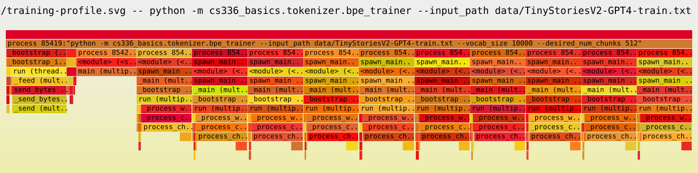

+++
title = 'Section 2: Byte Pair Encoding'
date = '2026-04-16T20:31:41+08:00'
summary = 'Train a BPE tokenizer from scratch.'
weight = 20
draft = false
+++

# Introduction

A tokenizer maps text to a sequence of integer token IDs. For a byte-level tokenizer, this transformation has two distinct stages:

$$
\text{Unicode text}
\xrightarrow{\text{UTF-8}}
\text{bytes}
\xrightarrow{\text{BPE}}
\text{token IDs}.
$$

The character encoding matters because the same text can produce different byte sequences:

```pycon
>>> "你好".encode("utf-8")
b'\xe4\xbd\xa0\xe5\xa5\xbd'
>>> "你好".encode("utf-16")
b'\xff\xfe`O}Y'
>>> "你好".encode("utf-32")
b'\xff\xfe\x00\x00`O\x00\x00}Y\x00\x00'
```

This assignment uses UTF-8 bytes as the base representation and learns a BPE vocabulary over them.

---

# Unicode and UTF-8

## Code Points

Unicode assigns each character a unique integer called a _code point_:

$$
\text{character}
\xrightarrow{\text{Unicode}}
\text{code point}.
$$

| Character | Code point |
| --- | --- |
| `a` | `U+0061` |
| `吃` | `U+5403` |
| `💩` | `U+1F4A9` |

A code point is an abstract identifier, not its byte representation. A Unicode transformation format determines how that integer is stored.

## Unicode Transformation Formats

$$
\text{code point}
\xrightarrow{\text{UTF}}
\text{byte sequence}.
$$

| Encoding | Bytes per code point | Main property |
| --- | ---: | --- |
| UTF-8 | 1–4 | Variable-width and ASCII-compatible |
| UTF-16 | 2 or 4 | Variable-width through surrogate pairs |
| UTF-32 | 4 | Fixed-width |

UTF-8 is the dominant representation of web text. Its ASCII compatibility is particularly useful for English-heavy corpora, while its variable width still covers every Unicode code point.

---

# Levels of Tokenization

| Level | Base unit | Coverage | Sequence length |
| --- | --- | --- | --- |
| Byte | Byte | Complete | Long |
| Word | Word | Requires unknown-token handling | Short |
| Subword | Learned byte or character sequence | Complete for byte-level methods | Intermediate |

Byte-level BPE combines the complete coverage of bytes with shorter sequences learned from corpus statistics.

---

# Byte-Level BPE

A byte-level BPE tokenizer begins with individual bytes and repeatedly joins frequent adjacent pairs into longer tokens. A trained tokenizer contains:

- a vocabulary associating token IDs with byte sequences;
- an ordered list of learned merges.

The following example shows the result of this process; its segmentation is learned from corpus statistics rather than predefined.






## Training

Training learns how to segment text into reusable tokens from the statistical patterns of a corpus. The resulting vocabulary and merge order together define the tokenizer.

### Initialization

The initial vocabulary contains all 256 byte values together with any special tokens:

$$
V_0 = \{\operatorname{bytes}(i) \mid 0 \leq i < 256\} \cup V_{\text{special}}.
$$

Every later token is formed by concatenating two existing tokens. The vocabulary therefore remains a set of byte sequences, and arbitrary input always has a valid byte-level representation.

### Pre-tokenization

Pre-tokenization divides the corpus into pieces within which BPE may learn merges.

It has two steps:

1. Split around **special tokens**, which must remain indivisible.
2. Apply the assignment's **regular expression** to the remaining text.

> [!example]- Pre-tokenization example
> 1. **Input**
>
>    ```text
>    low low lower<|endoftext|>high higher
>    ```
>
> 2. **After splitting around the special token**
>
>    ```text
>    ["low low lower", "high higher"]
>    ```
>
> 3. **After regex pre-tokenization**
>
>    ```text
>    ["low", " low", " lower", "high", " higher"]
>    ```

### Merge Iterations

BPE grows its vocabulary by repeatedly merging the most frequent adjacent token pair.

After pre-tokenization, the corpus can be represented by each unique piece $w$, its frequency $C(w)$, and its current tokenization $T_t(w)$ after $t$ merges. The corpus-wide frequency of an adjacent pair $(a,b)$ is

$$
P_t(a,b) = \sum_w C(w)\,N_{(a,b)}\!\left(T_t(w)\right),
$$

where $N_{(a,b)}$ counts occurrences of the pair inside a tokenized word. BPE selects the pair with the largest $P_t(a,b)$ and replaces every occurrence within a pre-tokenization boundary:

$$
(\ldots,a,b,\ldots) \longmapsto (\ldots,a \mathbin\Vert b,\ldots).
$$

The concatenated byte sequence $a \mathbin\Vert b$ becomes a new vocabulary entry, and $(a,b)$ is appended to the merge list.

> [!example]- One merge iteration
> Consider three pre-tokenized words with $C(\texttt{low})=4$, $C(\texttt{lot})=2$, and $C(\texttt{cat})=1$.
>
> - Before the merge: $T_t(\texttt{low})=(\texttt{l},\texttt{o},\texttt{w})$ and $T_t(\texttt{lot})=(\texttt{l},\texttt{o},\texttt{t})$.
> - The pair $(\texttt{l},\texttt{o})$ occurs $4+2=6$ times, more than any other pair.
> - After the merge: $T_{t+1}(\texttt{low})=(\texttt{lo},\texttt{w})$ and $T_{t+1}(\texttt{lot})=(\texttt{lo},\texttt{t})$.
>
> The new token `lo` is added to the vocabulary, while `cat` remains unchanged.

The merge list is ordered because each decision changes the pair distribution for the next iteration. A fixed tie-breaking rule is therefore part of the tokenizer: changing it can change every later merge even when the initial counts are identical.

### Updating Pair Counts

A full recount after every merge is unnecessary. If $(a,b)$ is selected, only words that contain this pair can change:

$$
\mathcal{A}_t(a,b) = \left\{w \mid N_{(a,b)}\!\left(T_t(w)\right) > 0\right\}.
$$

For any pair $p$, its count therefore changes by

$$
P_{t+1}(p)-P_t(p) = \sum_{w \in \mathcal{A}_t(a,b)} C(w)\left[N_p\!\left(T_{t+1}(w)\right)-N_p\!\left(T_t(w)\right)\right].
$$

Words outside $\mathcal{A}_t(a,b)$ make no contribution to this difference.

> [!example]- Updating only affected counts
> Continuing the example above, merging $(\texttt{l},\texttt{o})$ only affects `low` and `lot`:
>
> - remove $(\texttt{l},\texttt{o}):6$, $(\texttt{o},\texttt{w}):4$, and $(\texttt{o},\texttt{t}):2$;
> - add $(\texttt{lo},\texttt{w}):4$ and $(\texttt{lo},\texttt{t}):2$;
> - leave the pair counts inside `cat` unchanged.

This locality is the main algorithmic optimization. A pair-to-word index makes $\mathcal{A}_t$ directly accessible, while a priority queue avoids scanning all pairs when choosing the next merge.

## Encoding and Decoding

### Encoding

Encoding segments new text by replaying the merge order learned during training. It starts from UTF-8 bytes within the same pre-tokenization boundaries, while special tokens remain indivisible.

The decisions learned during training are stored as an ordered sequence of merges

$$
M = (m_1,m_2,\ldots,m_k).
$$

At each step, encoding applies the available merge that appears earliest in $M$. This is repeated independently within each pre-tokenized word until no learned pair remains.

### Decoding

Decoding concatenates the byte sequence associated with each token ID and then interprets the result as UTF-8:

$$
\text{token IDs}
\xrightarrow{\text{vocabulary}}
\text{byte sequences}
\xrightarrow{\text{UTF-8}}
\text{text}.
$$

> [!note]
> A slice of token IDs can end inside a multi-byte UTF-8 character. In that case, replacement decoding produces a valid string even though the concatenated bytes are not valid UTF-8 on their own.

---

# Solutions

> [!note]- Problem (`unicode1`): Understanding Unicode (1 point)
> > [!question]- (a) What Unicode character does `chr(0)` return?
> > **Deliverable:** A one-sentence response.
> >
> > **Answer**: The null character `'\x00'`, whose code point is `U+0000`.
>
> > [!question]- (b) How does this character's string representation (`__repr__()`) differ from its printed representation?
> > **Deliverable:** A one-sentence response.
> >
> > **Answer**: Printing emits the character itself, which is invisible. Its representation uses the visible escape sequence `'\x00'`.
>
> > [!question]- (c) What happens when this character occurs in text?
> > It may be helpful to compare the following expressions:
> >
> > ```pycon
> > >>> chr(0)
> > >>> print(chr(0))
> > >>> "this is a test" + chr(0) + "string"
> > >>> print("this is a test" + chr(0) + "string")
> > ```
> >
> > **Deliverable:** A one-sentence response.
> >
> > **Answer**: It remains part of the string even though it is not visible when printed:
> >
> > ```pycon
> > >>> list(("test" + chr(0) + "string").encode("utf-8"))
> > [116, 101, 115, 116, 0, 115, 116, 114, 105, 110, 103]
> > ```

> [!note]- Problem (`unicode2`): Unicode Encodings (3 points)
> > [!question]- (a) Why prefer UTF-8 encoded bytes to UTF-16 or UTF-32 for tokenizer training?
> > It may be helpful to compare the output of these encodings for various input strings.
> >
> > **Deliverable:** A one-to-two sentence response.
> >
> > **Answer**: UTF-8 is ASCII-compatible, widely used in text corpora, independent of byte order, and compact for English-heavy web text. UTF-16 can be smaller for some scripts, but its surrogate pairs and endianness make byte-level tokenization less direct.
> >
> > Python includes a byte-order mark in these `utf-16` and `utf-32` measurements:
> >
> > | Text | UTF-8 | UTF-16 | UTF-32 |
> > | --- | ---: | ---: | ---: |
> > | `To be, or not to be, that is the question.` | 42 bytes | 86 bytes | 172 bytes |
> > | `生存还是毁灭，这是个问题。` | 39 bytes | 28 bytes | 56 bytes |
>
> > [!question]- (b) Why is decoding a UTF-8 byte string one byte at a time incorrect?
> > Consider the following function, which is intended to decode a UTF-8 byte string into a Unicode string. Explain why it is incorrect and provide an input byte string that produces incorrect results.
> >
> > ```python
> > def decode_utf8_bytes_to_str_wrong(bytestring: bytes):
> >     return "".join(bytes([b]).decode("utf-8") for b in bytestring)
> >
> > decode_utf8_bytes_to_str_wrong("hello".encode("utf-8"))
> > # 'hello'
> > ```
> >
> > **Deliverable:** An example input byte string and a one-sentence explanation.
> >
> > **Answer**: UTF-8 characters may span several bytes. For example, `"奶"` is encoded as `b'\xe5\xa5\xb6'`; none of those bytes represents the character independently.
>
> > [!question]- (c) Give a two-byte sequence that does not decode to any Unicode character(s).
> > **Deliverable:** An example with a one-sentence explanation.
> >
> > **Answer**: `b"\x80\x80"`. Both bytes have the `10xxxxxx` continuation form, so neither can begin a valid UTF-8 sequence.
> >
> > UTF-8 byte prefixes have the following roles:
> >
> > - `0xxxxxxx`: a single-byte character;
> > - `110xxxxx`: the start of a two-byte sequence;
> > - `1110xxxx`: the start of a three-byte sequence;
> > - `11110xxx`: the start of a four-byte sequence;
> > - `10xxxxxx`: a continuation byte.

> [!note]- Problem (`train_bpe`): BPE Tokenizer Training (15 points)
> > [!question]- Deliverable: Train a byte-level BPE tokenizer from a text file
> > Write a function that accepts the following inputs:
> >
> > - `input_path: str`: path to the training text;
> > - `vocab_size: int`: maximum final vocabulary size, including the initial bytes, merged tokens, and special tokens;
> > - `special_tokens: list[str]`: tokens added to the vocabulary and treated as hard boundaries during training, but excluded from merge statistics.
> >
> > It must return:
> >
> > - `vocab: dict[int, bytes]`: the mapping from token IDs to token bytes;
> > - `merges: list[tuple[bytes, bytes]]`: the learned merges in creation order.
> >
> > The implementation is evaluated through `[adapters.run_train_bpe]` and the provided BPE training tests.
> >
> > **Answer**: The central state is the tokenization and frequency of each unique pre-tokenized word together with the global pair counts. Each iteration selects one pair, updates only the words containing it, and records the merge for later encoding.

> [!note]- Problem (`train_bpe_tinystories`): BPE Training on TinyStories (2 points)
> > [!question]- (a) Train a byte-level BPE tokenizer on TinyStories
> > Use a maximum vocabulary size of 10,000, add `<|endoftext|>` as a special token, and serialize the resulting vocabulary and merges. How much time and memory does training take? What is the longest token in the vocabulary, and does it make sense?
> >
> > **Resource requirements:** $\leq 30$ minutes without GPUs and $\leq 30$ GB RAM.
> >
> > **Deliverable:** A one-to-two sentence response.
> >
> > **Answer**:
> >
> > - Pre-tokenization took approximately **18 seconds**, and merging took **1 second**.
> > - Peak memory usage was approximately **2.35 GiB**, including worker processes.
> > - The longest token was `b' accomplishment'`, with a length of 15 bytes.
> > - The token is a common complete word in TinyStories, which is consistent with BPE's frequency objective.
> >
> > > [!example]- Measure peak memory
> > > ```bash
> > > uv run --with memory-profiler --with psutil mprof run \
> > >   --include-children --multiprocess \
> > >   python -m cs336_basics.tokenizer.bpe_trainer \
> > >   --input_path data/TinyStoriesV2-GPT4-train.txt \
> > >   --vocab_size 10000 --desired_num_chunks 512
> > > uv run --with memory-profiler --with psutil mprof peak
> > > ```
>
> > [!question]- (b) Profile the tokenizer training code. What part takes the most time?
> > **Deliverable:** A one-to-two sentence response.
> >
> > **Answer**: The full training run took approximately **19 seconds** and peaked at **2.35 GiB** of memory. About **95%** of the wall-clock time was spent in pre-tokenization, making corpus scanning—not merge construction—the main bottleneck.
> >
> > - **Pre-tokenization (~95% of wall-clock time):** this stage dominates training.
> >   - **Regex matching (~78% of pre-tokenization samples):** `regex.findall` is the largest CPU hotspot.
> >   - **Word counting (~22% of pre-tokenization samples):** `Counter.update` accounts for most of the remaining work.
> > - **Merge iterations (~5% of wall-clock time):** the vocabulary construction itself takes only about 1 second.
> >
> > > [!example]- Full flame graph
> > > [](figures/training-profile.svg)
> > >
> > > The graph includes the parent process and all worker processes. Open it at full size to inspect individual stacks.
> >
> > > [!example]- Reproduce the profile
> > > ```bash
> > > sudo uv run --group profile py-spy record --subprocesses \
> > >   -o outputs/tokenizer/TinyStories/training-profile.svg \
> > >   -- python -m cs336_basics.tokenizer.bpe_trainer \
> > >   --input_path data/TinyStoriesV2-GPT4-train.txt \
> > >   --vocab_size 10000 --desired_num_chunks 512
> > > ```

> [!note]- Problem (`train_bpe_expts_owt`): BPE Training on OpenWebText (2 points)
> > [!question]- (a) Train a byte-level BPE tokenizer on OpenWebText
> > Use a maximum vocabulary size of 32,000 and serialize the resulting vocabulary and merges. What is the longest token in the vocabulary, and does it make sense?
> >
> > **Resource requirements:** $\leq 12$ hours without GPUs and $\leq 100$ GB RAM.
> >
> > **Deliverable:** A one-to-two sentence response.
> >
> > **Answer**:
> >
> > - Pre-tokenization took approximately **2 minutes 33 seconds**, and merging took **6 minutes 13 seconds**, for a total of **8 minutes 46 seconds**.
> > - The longest token was a 64-byte repeated encoding artifact found in the corpus.
> > - Its presence shows that BPE learns frequent byte sequences without distinguishing meaningful language from corrupted text.
> >
> > > [!example]- Reproduce the OpenWebText experiment
> > > ```bash
> > > uv run python -m cs336_basics.tokenizer.bpe_trainer \
> > >   --input_path data/owt_train.txt \
> > >   --vocab_size 32000 --desired_num_chunks 512
> > > ```
>
> > [!question]- (b) Compare and contrast the tokenizers trained on TinyStories and OpenWebText.
> > **Deliverable:** A one-to-two sentence response.
> >
> > **Answer**:
> >
> > | Corpus | Vocabulary size | Training time | Longest token |
> > | --- | ---: | ---: | --- |
> > | TinyStories | 10,000 | $\approx 19$ seconds | `b' accomplishment'` |
> > | OpenWebText | 32,000 | $\approx 8$ minutes $46$ seconds | 64-byte encoding artifact |
> >
> > TinyStories produces a vocabulary specialized for simple, clean stories, whereas OpenWebText also absorbs web-specific noise and encoding artifacts. BPE reflects corpus statistics rather than an external notion of linguistic quality.

> [!note]- Problem (`tokenizer`): Implementing the Tokenizer (15 points)
> > [!question]- Deliverable: Implement the tokenizer
> > Implement a `Tokenizer` that loads a vocabulary and ordered merges, encodes text into token IDs, decodes token IDs into text, and supports user-provided special tokens by adding any that are not already in the vocabulary. Provide the following interface:
> >
> > - `__init__(vocab, merges, special_tokens=None)`: construct a tokenizer from in-memory data;
> > - `from_files(vocab_filepath, merges_filepath, special_tokens=None)`: construct one from serialized vocabulary and merges;
> > - `encode(text: str) -> list[int]`: encode text;
> > - `encode_iterable(iterable: Iterable[str]) -> Iterator[int]`: lazily encode a stream without loading it entirely into memory;
> > - `decode(ids: list[int]) -> str`: decode token IDs into text.
> >
> > The implementation is evaluated through `[adapters.get_tokenizer]` and the provided tokenizer tests.
> >
> > **Answer**: The learned merge order defines the segmentation of ordinary text, while special tokens remain atomic. Decoding needs only the vocabulary because token boundaries disappear after their byte sequences are concatenated.

> [!note]- Problem (`tokenizer_experiments`): Experiments with Tokenizers (4 points)
> > [!question]- (a) Measure compression on TinyStories and OpenWebText
> > Sample 10 documents from each dataset. Encode them with the previously trained TinyStories and OpenWebText tokenizers, whose vocabulary sizes are 10,000 and 32,000, respectively. What is each tokenizer's compression ratio in bytes per token?
> >
> > **Deliverable:** A one-to-two sentence response.
> >
> > **Answer**: For text $x$, define the compression ratio as
> >
> > $$R(x) = \frac{\text{number of UTF-8 bytes in }x}{\text{number of tokens in }x}.$$
> >
> > The in-domain ratios are **4.1328 bytes/token** for TinyStories and **4.5400 bytes/token** for OpenWebText.
> >
> > > [!example]- Reproduce the compression measurements
> > > ```bash
> > > uv run python -m cs336_basics.tokenizer.bpe_tokenizer benchmark
> > > ```
>
> > [!question]- (b) Tokenize the OpenWebText sample with the TinyStories tokenizer
> > Compare the compression ratio and/or qualitatively describe what happens.
> >
> > **Deliverable:** A one-to-two sentence response.
> >
> > **Answer**: The compression ratio drops from **4.5400** to **3.3475 bytes/token**, a reduction of about 26%. The TinyStories vocabulary must decompose unfamiliar web patterns into smaller units.
> >
> > Encoding speed is the median of five cold-cache measurements on the same 10-document sample:
> >
> > | Dataset | Tokenizer | Speed | Bytes/token |
> > | --- | --- | ---: | ---: |
> > | TinyStories | TinyStories | 4.0496 MB/s | 4.1328 |
> > | TinyStories | OpenWebText | 4.0662 MB/s | 3.9918 |
> > | OpenWebText | TinyStories | 3.4162 MB/s | 3.3475 |
> > | OpenWebText | OpenWebText | 3.2137 MB/s | 4.5400 |
> >
> > The compression ratios depend strongly on whether the tokenizer matches the data distribution. Throughput, by contrast, is nearly unchanged between tokenizers on the same dataset and varies more with the dataset itself.
> >
> > > [!example]- Reproduce the cross-domain comparison
> > > ```bash
> > > uv run python -m cs336_basics.tokenizer.bpe_tokenizer benchmark
> > > ```
>
> > [!question]- (c) Estimate tokenizer throughput and the time required to tokenize the Pile
> > Estimate throughput in bytes per second. How long would it take to tokenize the 825 GB Pile dataset?
> >
> > **Deliverable:** A one-to-two sentence response.
> >
> > **Answer**: Using $t=D/v$, the measured in-domain rates of **4.0496 MB/s** and **3.2137 MB/s** imply about **57 hours** and **71 hours**, respectively. This is only a local extrapolation: tokenizer throughput also depends on document structure and measurement conditions.
> >
> > > [!example]- Reproduce the throughput benchmark
> > > ```bash
> > > uv run python -m cs336_basics.tokenizer.bpe_tokenizer benchmark
> > > ```
>
> > [!question]- (d) Serialize the TinyStories and OpenWebText datasets as token IDs
> > Encode the respective training and development datasets for later language-model training. Serialize the token IDs as NumPy arrays with datatype `uint16`. Why is `uint16` an appropriate choice?
> >
> > **Deliverable:** A one-to-two sentence response.
> >
> > **Answer**: Both vocabulary sizes satisfy
> >
> > $$|V| \leq 32{,}000 < 2^{16} = 65{,}536.$$
> >
> > so every token ID fits in two bytes.
