+++
title = 'Section 7: Experiments'
date = '2026-07-01T22:46:46+08:00'
summary = 'Study optimization, architecture, and data through controlled language-model experiments.'
weight = 70
draft = false
+++

# Introduction

The preceding sections provide all the components of a language-model training system. Experiments turn that system into a way to study how optimization, architecture, and data determine model behavior.

Each comparison changes one factor while keeping the remaining conditions fixed. The goal is therefore not only to obtain a low validation loss, but to identify which intervention caused a change and what the resulting curves reveal about training.

---

# Experimental Design

Unless stated otherwise, the model uses:

- 4 Transformer blocks;
- model dimension $d_{\text{model}}=512$;
- 16 attention heads;
- SwiGLU with $d_{\text{ff}}=1344$;
- pre-norm RMSNorm;
- RoPE with $\Theta=10{,}000$;
- a context length of 256 tokens.

The TinyStories and OpenWebText baselines each process approximately 327.68 million tokens. For microbatch size $B_{\text{micro}}$, gradient accumulation $G$, context length $L$, and $S$ optimizer steps, the training budget is

$$
N_{\text{tokens}} = B_{\text{micro}}GLS.
$$

Shorter sweeps use a smaller fixed token budget within each comparison. TinyStories provides a regular domain in which optimization and architectural effects are easy to observe; OpenWebText tests the same model against a much broader distribution. Unless noted otherwise, each reported value comes from one matched run, so small differences should be read as observations under these conditions rather than uncertainty estimates.

## Experiment Tracking

Loss curves are indexed by three complementary measures of progress:

- **Optimizer steps** describe convergence across parameter updates.
- **Tokens processed** measure how efficiently a model learns from data.
- **Wall-clock time** measures how efficiently it uses the available compute.

Model behavior is summarized by the corresponding response metrics:

- **Training loss** describes progress on the optimization objective.
- **Validation loss** measures performance on unseen data and is the primary basis for comparing models.
- **Gradient norm and clipping rate** diagnose instability when the loss curve alone does not explain a run.

These coordinates and metrics answer different questions. A configuration may improve faster per token without improving faster per minute, while a lower training loss need not imply a better validation result. Each experiment therefore uses the pair that matches the question being studied.

---

# Vocabulary and Context

Tokenization determines the units presented to the model, while context length determines how many of those units can interact. Both choices therefore affect statistical efficiency and computational cost before any optimization hyperparameter is changed.

## Vocabulary Size

A larger BPE vocabulary represents the same text with fewer tokens, but expands both the input embedding and output projection. Since token-level loss changes with the tokenization itself, vocabulary sizes are compared through bytes per token and

$$
\operatorname{bits/byte} = \frac{\mathcal{L}_{\text{token}}}{\ln 2}\,\frac{1}{\operatorname{bytes/token}}.
$$

Throughput is measured on one A100 under the same training configuration.

| Vocabulary size | Parameters | Bytes per token | Throughput | Validation bits/byte |
| ---: | ---: | ---: | ---: | ---: |
| 5k | 17.58M | 4.0475 | **74.97k tokens/s** | 0.5681 |
| 10k | 22.70M | 4.1169 | 71.03k tokens/s | 0.5650 |
| 20k | 32.94M | **4.1283** | 57.58k tokens/s | **0.5616** |

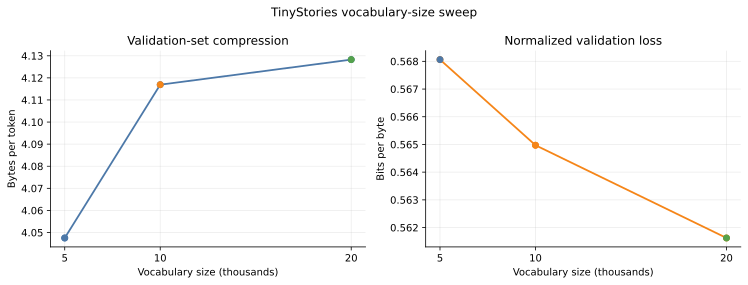

The gain from 10k to 20k is small: compression improves by only $0.28\%$ and validation bits per byte by $0.60\%$, while the model grows by roughly $45\%$ and throughput falls by $19\%$. The 5k vocabulary is cheaper but slightly less effective per byte. For TinyStories, 10k therefore captures most of the available compression without paying for a much larger output layer.

## Context Length

The context sweep fixes the model, tokenizer, token budget, and relative learning-rate schedule. Changing $L$ changes both the number of optimizer steps and the cost of each step, so final perplexity and per-iteration runtime must be considered together. All runtime measurements use the same A100.

| Context length | Optimizer steps | Time per step | Throughput | Final perplexity |
| ---: | ---: | ---: | ---: | ---: |
| 128 | 2,000 | **0.437 s** | **74.95k tokens/s** | 5.142 |
| 256 | 1,000 | 0.923 s | 71.03k tokens/s | **5.014** |
| 512 | 500 | 2.093 s | 62.63k tokens/s | 5.634 |

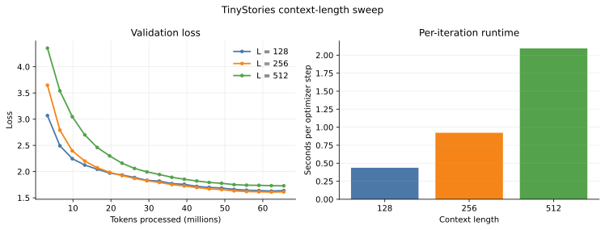

Length 256 gives the best balance under the fixed 65.536-million-token budget. Shortening the context reduces step time but loses useful history; length 512 more than doubles the cost of a 256-token step and leaves only half as many parameter updates. The longer receptive field does not compensate for those costs at this model scale and training budget.

---

# Optimization

Optimization experiments determine the scale and frequency of parameter updates before architectural changes are compared. Learning rate controls the size of each update, while batch size controls both gradient noise and the number of updates available under a fixed token budget.

## Learning Rate

A logarithmic sweep spans conservative updates, rapid convergence, and outright instability without requiring a dense search. Every run processes 65.536 million tokens with the same model, batch size, and schedule; only the peak learning rate changes.

| Peak learning rate | Best validation loss | Final validation loss | Outcome |
| ---: | ---: | ---: | --- |
| $10^{-3}$ | $1.7765$ | $1.7801$ | Stable |
| $3\times10^{-3}$ | **$1.6096$** | **$1.6122$** | Fastest convergence |
| $10^{-2}$ | $2.1027$ | $2.1078$ | Stable but poorly optimized |
| $10^{-1}$ | $3.9343$ | $4.4081$ at step 190 | Divergent |

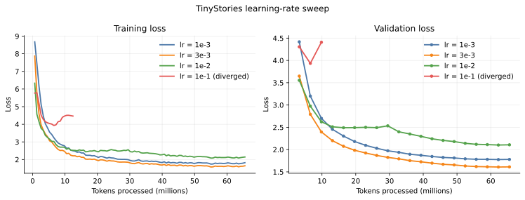

The tested transition to divergence lies between $10^{-2}$ and $10^{-1}$, but validation performance has already deteriorated at $10^{-2}$. Increasing the rate from $10^{-3}$ to $3\times10^{-3}$ accelerates convergence; increasing it again makes optimization worse before numerical divergence appears. The best finite-budget learning rate therefore lies inside the stable region rather than at its boundary.

The sweep selects $3\times10^{-3}$. Extending that configuration to the full 327.68-million-token budget reaches a best validation loss of $1.3425$ and a final loss of $1.3430$, satisfying the TinyStories target of $1.45$.

## Batch Size

The controlled comparison fixes the learning rate at $3\times10^{-3}$ and gives every run 32.768 million tokens. Batch size therefore changes the number of parameter updates and the efficiency of each update, but not the amount of data observed.

| Batch size | Optimizer steps | Final validation loss | Throughput |
| ---: | ---: | ---: | ---: |
| $1$ | 128,000 | $1.8221$ | $20.1$k tokens/s |
| $16$ | 8,000 | $1.7302$ | $64.4$k tokens/s |
| $64$ | 2,000 | **$1.7220$** | $69.9$k tokens/s |
| $128$ | 1,000 | $1.7535$ | $70.3$k tokens/s |
| $256$ | 500 | $1.9407$ | $69.7$k tokens/s |

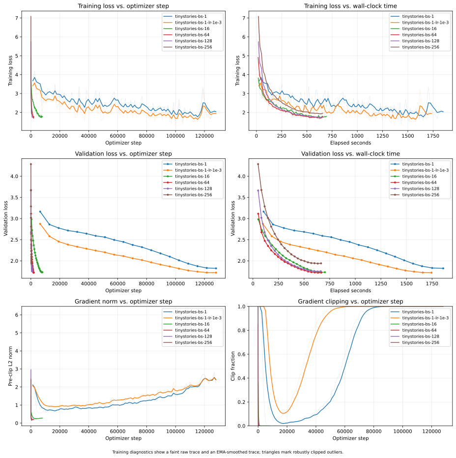

Throughput rises sharply up to batch size 64 and then saturates. Beyond that point, larger batches provide fewer updates without processing tokens any faster, and validation loss worsens. Batch size 64 gives the strongest fixed-rate result near maximum throughput; batch size 256 establishes the memory-limit case rather than a useful operating point.

Batch size 1 behaves differently because its highly noisy updates change the suitable optimization scale. Its learning rate is therefore retuned separately from the fixed-rate comparison above.

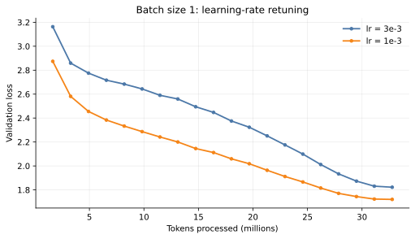

Reducing the learning rate to $10^{-3}$ improves final validation loss from $1.8221$ to $1.7203$, but leaves throughput at only $21.5$k tokens/s. The result shows an interaction between batch size and learning rate without confounding the main batch-size comparison.

---

# TinyStories Generation

The TinyStories baseline produces short narratives with stable characters and a recognizable conclusion. With temperature $1.0$ and top-$p=0.9$, the following completion emits 138 tokens before `<|endoftext|>`.

> [!example]- TinyStories generation
> **Prompt:** `Once upon a time`
>
> Once upon a time, there was a big castle. In the castle, there lived a clever girl named Lucy. Lucy liked to play in the castle all day. She had many toys and games to spend in the fun.
> One day, Lucy saw a little cat outside her window. The cat was hungry and could not find any food. Lucy wanted to help the cat, so she had an idea. She thought she could make the cat's food.
> Lucy took the cat to her mom and dad. They made the cat's food and gave it some milk. The cat was happy and not hungry anymore. Lucy and the cat became best friends and had lots of fun together.

The phrase “games to spend in the fun” exposes imperfect local semantics, but the overall narrative remains coherent. Corpus regularity and training budget determine what story structure the model has learned, while temperature and top-$p$ determine how sharply decoding concentrates on its most likely continuations.

---

# Architectural Ablations

The ablations use a common 163.84-million-token budget. Each one removes or replaces a single component of the baseline, turning the validation curve into direct evidence about that component under otherwise matched conditions.

## RMSNorm

Removing RMSNorm at the selected learning rate $3\times10^{-3}$ causes catastrophic instability by step 120: the gradient norm reaches approximately $6.35\times10^6$ and training loss exceeds $1.6\times10^5$. Reducing the rate tenfold restores finite training, but validation loss reaches only $1.8244$, compared with $1.4364$ for the matched normalized model.

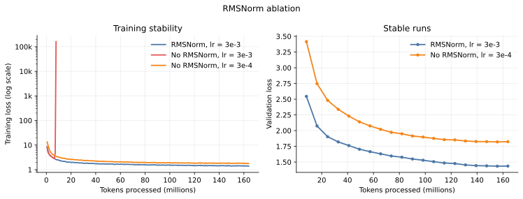

RMSNorm changes the optimization regime, not merely the final fit. It makes a larger and more effective learning rate usable; lowering the rate can suppress divergence after normalization is removed, but does not recover the lost convergence speed.

## Normalization Placement

Moving normalization from before each sublayer to after the residual addition preserves stability but slightly weakens the final result. Post-norm reaches a validation loss of $1.4449$, while pre-norm reaches $1.4364$.

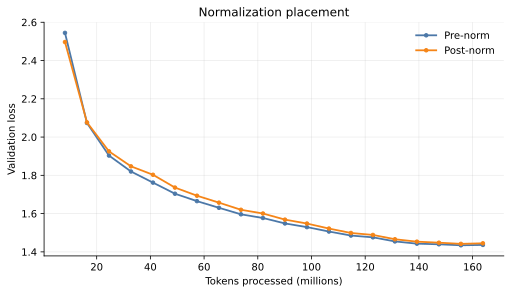

The two curves remain close throughout training. Pre-norm finishes $0.0085$ lower in this run, a small observed advantage rather than a large change in optimization behavior.

## Position Information

Removing RoPE leaves the model without an explicit representation of token order or distance. NoPE still learns, but finishes at a validation loss of $1.5201$, compared with $1.4364$ for RoPE.

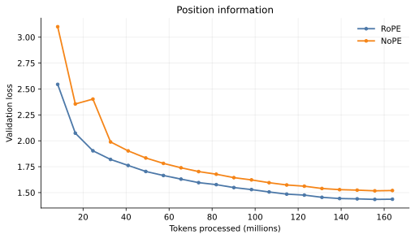

The causal mask determines which tokens are visible at each position, so it supplies a limited ordering signal even without positional encoding. The remaining penalty of $0.0837$ is nevertheless the clearest quality difference among the matched architectural ablations.

## Feed-Forward Network

To separate gating from model size, the ungated SiLU network uses $d_{\text{ff}}=4d_{\text{model}}$. The resulting models are closely matched: SwiGLU has 22,696,448 parameters and SiLU has 22,827,520, a difference of only $0.58\%$.

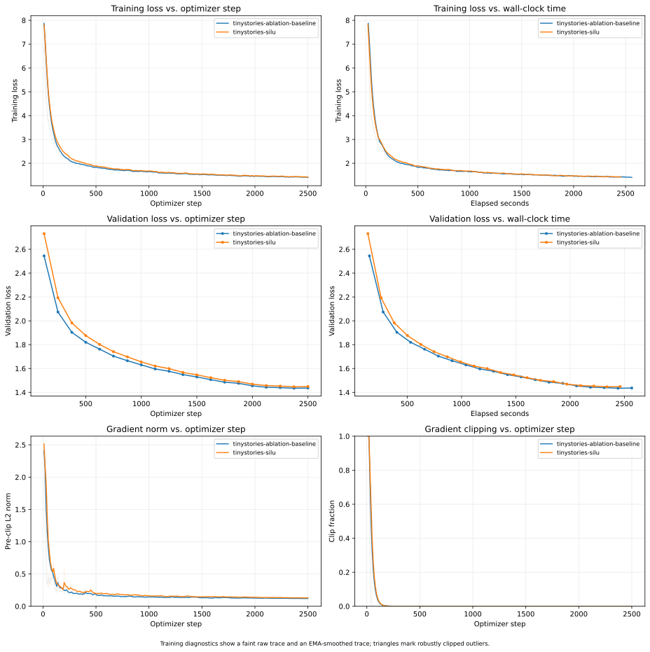

SwiGLU reaches a final validation loss of $1.4364$, compared with $1.4489$ for SiLU. The multiplicative gate gives a modest $0.0125$ advantage in this run; its effect is much smaller than removing positional information or normalization.

---

# Training on OpenWebText

TinyStories and OpenWebText use the same model architecture, 5000 optimizer steps, and 327.68-million-token budget. OpenWebText nevertheless reaches a final validation loss of $3.9337$, while TinyStories reaches $1.3430$.

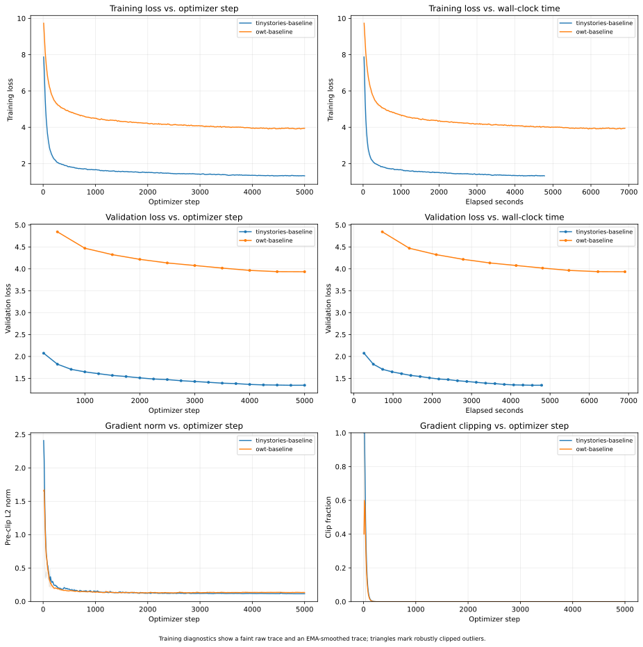

OpenWebText spans a much wider range of topics, styles, entities, and long-range dependencies. The same model and token budget therefore cover its distribution far less thoroughly than the regular narrative patterns in TinyStories. The corresponding perplexities are approximately $51.09$ and $3.83$, but the datasets use different 32k and 10k tokenizers, so neither loss nor perplexity is a controlled cross-dataset ranking.

The generated text shows the same distinction. Local syntax and register emerge before the model can preserve entities and causal structure across a longer passage.

> [!example]- OpenWebText generation
> **Prompt:** `The`
>
> The Clinton campaign and the Democratic candidate in her husband’s bedroom were forced to walk away, they are not being violent or rebellious, they are not even dealing with these late-night pictures of a drug addict.”
>
> Sharia has been released from prison without any major charges. For the same reason she was in prison, she was handed the terms of her second life sentence. She could have been charged by state police.
>
> In the end, the FBI isn’t seeking prosecution, instead, for the suspects that should serve the country in the country or in other cases. In truth, cases like this now aren’t without merit, or coercion, or criminal activity.
>
> The Trump campaign has kept the promise from the FBI and is calling on it to dissolve local prosecutors. The DOJ says that without law, the FBI does not use such a policy to give some details about the criminal justice system in a racially diverse style.
>
> The first three judges are Comey. And then he’s pushing them.
>
> They basically just say they’re important for law enforcement.
>
> There are five Republicans in charge of the Republican Party, with Democrats out on the front line. In 2016, they were major targets for special elections and they finally

The 256-token sample reproduces the surface form of political news, but entities and causal relations drift across paragraphs and the final sentence remains incomplete. Under this compute budget, surface fluency appears before reliable discourse coherence.

---

# Leaderboard

The leaderboard constrains training by wall-clock time rather than by optimizer steps. These experiments run on an A100 instead of the official B200 environment, so they provide a local 45-minute proxy rather than a leaderboard submission.

The model uses $d_{\text{model}}=448$, 4 layers, 7 heads, $d_{\text{ff}}=1344$, batch size 32, and a peak learning rate of $2\times10^{-3}$. The smaller width increases the number of updates that fit within the time budget while retaining enough capacity to beat the naive validation loss of $5.0$.

A first pilot revealed that a 5000-step cosine schedule exhausted its learning rate in roughly 15 minutes. The schedule was tied to an assumed number of steps rather than the measured A100 throughput. Extending the decay horizon to 17,000 steps aligns optimization with the available 45 minutes.

| Gradient-clipping threshold | Final step | Tokens processed | Final validation loss | Wall-clock time |
| ---: | ---: | ---: | ---: | ---: |
| $0.25$ | 16,431 | 134.60M | $4.0963$ | 44m 52s |
| $1.0$ | 16,737 | 137.11M | **$4.0922$** | 44m 52s |

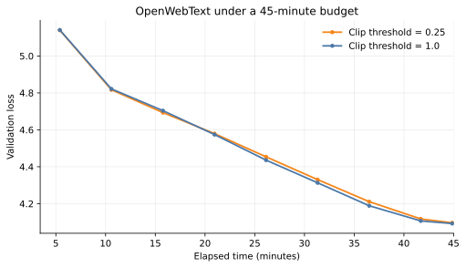

The threshold $0.25$ clips nearly every update without improving validation loss. Standard clipping at $1.0$ permits slightly more progress and reaches the best loss, $4.0922$. The difference between the two final runs is small; the larger improvement comes from aligning the learning-rate schedule with the time budget and processing as many useful updates as possible.

---

# Solutions

> [!note]- Problem (`experiment_log`): Experiment Logging (3 points)
> For your training and evaluation code, create experiment tracking infrastructure that allows you to track your experiments and loss curves with respect to gradient steps and wall-clock time.
>
> > [!question]- Deliverable: Logging infrastructure code for your experiments and an experiment log for the assignment problems below in this section
> > **Answer**: See [Experiment Tracking](#experiment-tracking). The remaining sections form the experiment log.

> [!note]- Problem (`learning_rate`): Tune the Learning Rate (2 B200 hrs) (3 points)
> The learning rate is one of the most important hyperparameters to tune. Taking the base model you have trained, answer the following questions.
>
> > [!question]- (a) Perform a hyperparameter sweep over the learning rates and report the final losses or note divergence if the optimizer diverges
> > **Deliverables:** Learning curves associated with multiple learning rates, an explanation of the search strategy, and a TinyStories model with per-token validation loss at most $1.45$.
> >
> > **Answer**: See [Learning Rate](#learning-rate).
>
> > [!question]- (b) Investigate how the point at which learning rates diverge is related to the best learning rate
> > **Deliverable:** Learning curves of increasing learning rate including at least one divergent run, together with an analysis of convergence rates.
> >
> > **Answer**: See [Learning Rate](#learning-rate).

> [!note]- Problem (`batch_size_experiment`): Batch Size Variations (1 B200 hr) (1 point)
> Vary your batch size all the way from 1 to the GPU memory limit. Try at least a few batch sizes in between, including typical sizes like 64 and 128.
>
> > [!question]- Deliverables
> > Learning curves for different batch sizes, with learning rates re-optimized if necessary, and a discussion of their effects on training.
> >
> > **Answer**: See [Batch Size](#batch-size).

> [!note]- Problem (`generate`): Generate Text (1 point)
> Using your decoder and trained checkpoint, report the text generated by your model. You may need to manipulate decoder parameters such as temperature and top-$p$ to get fluent outputs.
>
> > [!question]- Deliverable
> > A text dump of at least 256 tokens, or until the first `<|endoftext|>` token, and a brief comment on fluency and at least two factors that affect output quality.
> >
> > **Answer**: See [TinyStories Generation](#tinystories-generation).

> [!note]- Problem (`layer_norm_ablation`): Remove RMSNorm and Train (0.5 B200 hrs) (1 point)
> Remove all RMSNorms from the Transformer and train. What happens at the previous optimal learning rate? Can stability be recovered with a lower learning rate?
>
> > [!question]- Deliverables
> > A learning curve without RMSNorm, a curve for the best lower learning rate, and commentary on the impact of RMSNorm.
> >
> > **Answer**: See [RMSNorm](#rmsnorm).

> [!note]- Problem (`pre_norm_ablation`): Implement Post-Norm and Train (0.5 B200 hrs) (1 point)
> Modify the pre-norm Transformer into a post-norm one and train it.
>
> > [!question]- Deliverable
> > A learning curve for a post-norm Transformer compared with the pre-norm model.
> >
> > **Answer**: See [Normalization Placement](#normalization-placement).

> [!note]- Problem (`no_pos_emb`): Implement NoPE (0.5 B200 hrs) (1 point)
> Remove position information entirely from the Transformer and compare the result with RoPE.
>
> > [!question]- Deliverable
> > A learning curve comparing RoPE and NoPE.
> >
> > **Answer**: See [Position Information](#position-information).

> [!note]- Problem (`swiglu_ablation`): SwiGLU vs. SiLU (0.5 B200 hrs) (1 point)
> Compare the default SwiGLU feed-forward network with an ungated SiLU network, $\operatorname{FFN}_{\text{SiLU}}(x)=W_2\operatorname{SiLU}(W_1x)$, using $d_{\text{ff}}=4d_{\text{model}}$ for SiLU to approximately match parameter counts.
>
> > [!question]- Deliverables
> > A learning curve comparing SwiGLU and SiLU with approximately matched parameter counts, together with a discussion of the result.
> >
> > **Answer**: See [Feed-Forward Network](#feed-forward-network).

> [!note]- Problem (`main_experiment`): Experiment on OpenWebText (2 B200 hrs) (2 points)
> Train the language model on OpenWebText with the same model architecture and total training iterations as TinyStories. How well does it perform?
>
> > [!question]- Deliverables
> > An OpenWebText learning curve; an interpretation of its loss relative to TinyStories; generated text in the same format as the TinyStories output; and an explanation of the difference in fluency.
> >
> > **Answer**: See [Training on OpenWebText](#training-on-openwebtext).

> [!note]- Problem (`leaderboard`): Leaderboard (10 B200 hrs) (6 points)
> Train a model under the leaderboard rules with the goal of minimizing validation loss within 0.75 B200-hours. Training may use only the provided OpenWebText data.
>
> > [!question]- Deliverable
> > The final validation loss, a learning curve with a wall-clock axis shorter than 45 minutes, and a description of the approach. A submission is expected to beat the naive baseline loss of $5.0$.
> >
> > **Answer**: See [Leaderboard](#leaderboard).
